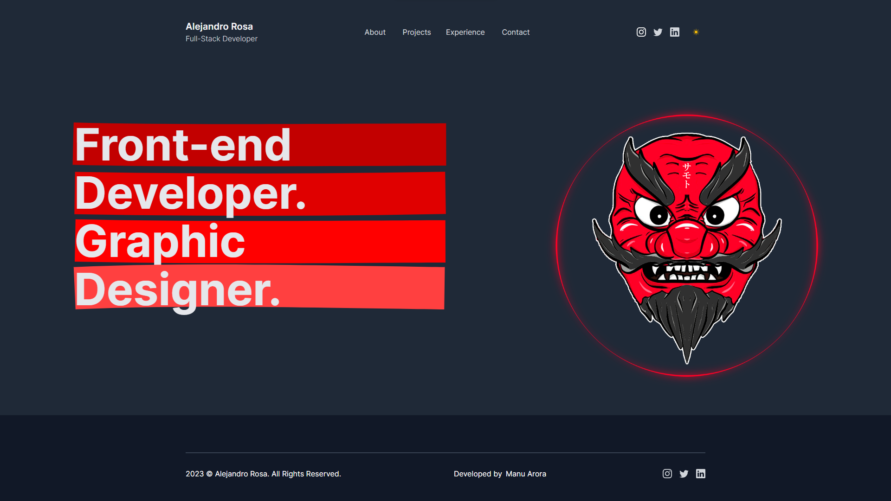

# My Portfolio

This is my personal portfolio, based on the [original template](https://github.com/manuarora700/simple-developer-portfolio-website) by [manuarora700](https://github.com/manuarora700). Here you will find information about me, my projects, and how to get in touch.

## About Me

A brief description about myself. My journey, including education, experience, and key skills as a developer.

## Featured Projects

List some of my most notable projects. Including screenshots and links to the corresponding websites.

## Experience

List of my relevant work experience this latest years.

## Tech Stack
The website is built in my favourite Tech Stack and deployed on Vercel.

- **Next.js** for building React Components.
- **tailwindcss** for styling.
- **React** Rough Notation for Hero section highlighting.
- **Vercel** for deployments and CI/CD.

## Contributions and Contact

If you're interested in collaborating on projects or have any questions, feel free to reach out to me:

- **Email:** halejandrorosa@gmail.com
- **LinkedIn:** [Alejandro Rosa](https://www.linkedin.com/in/h-alejandro-rosa/)
- **GitHub:** [SamotSama](https://github.com/SamotSama)  

